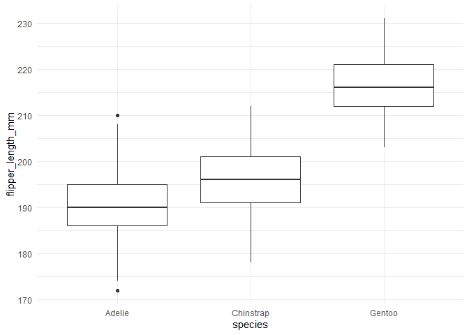

# summarystatistics

The R package `summarystatistics` includes the function
`summarize_stats`. The function computes five summary statistics
(minimum, maximum, mean, and two quantiles) of a numerical variable
across the groups of a categorical variable. The function also produces
a simple boxplot that allows for visual comparison between the
distributions of the numerical variable across the different groups of
the categorical variable.

## Installation instructions

Install `summarystatistics` package from GitHub:

``` r
devtools::install_github("kearutherford/Assignment_B2_Rutherford", ref = "0.1.0")
```

## Demonstrations

``` r
# Load required packages -------------------------------------------------------

suppressPackageStartupMessages(library(datateachr))
suppressPackageStartupMessages(library(tidyverse))
suppressPackageStartupMessages(library(summarystatistics))
```

The following examples demonstrate how to use the `summarize_stats`
function in the R package `summarystatistics`. The examples rely on the
[vancouver_trees](https://opendata.vancouver.ca/explore/dataset/street-trees/information/?disjunctive.species_name&disjunctive.common_name&disjunctive.height_range_id&location=11,49.26339,-123.12046)
data set included in the `datateachr` package. The data set provides an
inventory of the public street trees in Vancouver, BC.

I created a simplified data set to use in the demonstrations. I only
used three attributes from the vancouver_trees data set in the examples:
`root_barrier`, `genus_name` and `diameter`. I selected a subset of the
tree genera (five in total). I also filtered out the improbable DBH
values (here I define improbable as DBH = 0 inches and DBH \> 100
inches). Filtering out the improbable DBH values makes data
visualization much nicer. Lastly, in the original data set the
`genus_name` variable has a character class. I wanted to demonstrate
that a variable with a factor class will also work for this function, so
I converted the `genus_name` variable into a factor.

``` r
# Create a simplified data set to use in examples ------------------------------
van_trees_2 <- vancouver_trees %>%
    filter(diameter > 0, diameter < 100, # filter out improbable DBH values
    genus_name %in% c("PRUNUS", "ACER", "MAGNOLIA", "QUERCUS", "TILIA")) %>% # filter for 5 tree genera only
    mutate(genus_name = as.factor(genus_name)) %>% # create a factor variable for demonstration purposes 
    select(root_barrier, genus_name, diameter) # select variables I will use in the examples 
head(van_trees_2)
#> # A tibble: 6 x 3
#>   root_barrier genus_name diameter
#>   <chr>        <fct>         <dbl>
#> 1 N            ACER           9   
#> 2 N            ACER          15   
#> 3 N            ACER          14   
#> 4 N            ACER          16   
#> 5 N            TILIA          7.75
#> 6 N            TILIA         16
```

**Variables used throughout examples:**

| Variable     | Brief description                                 | Class     |
|:-------------|:--------------------------------------------------|:----------|
| root_barrier | root barrier installed (Y = Yes, N = No)          | character |
| genus_name   | name of the genus the tree belongs to             | factor    |
| diameter     | diameter at breast height (DBH) of tree in inches | numeric   |

### Example #1: Character variable input, keep default arguments

**Description of inputs:** In this first example, I demonstrate
inputting a variable with a character class for the `categoric_var`
argument. The default arguments are kept (`prob1` = 0.25, `prob2` =
0.75, `na.rm` = TRUE).

| Argument      | Input        | Description                                                                     |
|:--------------|:-------------|:--------------------------------------------------------------------------------|
| data          | van_trees_2  | the input is an object of class data.frame                                      |
| categoric_var | root_barrier | the input is a variable from the van_trees_2 data set with a class of character |
| numeric_var   | diameter     | the input is a variable from the van_trees_2 data set with a class of numeric   |

``` r
# Run summarize_stats() function with Van_trees_2 data set ---------------------
summarize_stats(data = van_trees_2, 
                categoric_var = root_barrier,
                numeric_var = diameter)
#> [[1]]
#> # A tibble: 2 x 6
#>   root_barrier minimum maximum  mean quantile_1 quantile_2
#>   <chr>          <dbl>   <dbl> <dbl>      <dbl>      <dbl>
#> 1 N               0.25      99 12.6           5      18   
#> 2 Y               1.25      86  4.73          3       5.75
#> 
#> [[2]]
```


**Description of output:** The output is a list with two items: a tibble
of summary statistics and a simple boxplot. For the summary tibble, the
minimum, maximum, mean, first quartile, and third quartile were
calculated for DBH across the two root barrier groups (Y/N). The boxplot
shows the difference in the distributions of DBH between the two root
barrier groups.

### Example #2: Factor variable input, alter default arguments

**Description of inputs:** In this second example, I demonstrate
inputting a variable with a factor class for the `categoric_var`
argument. The `prob1` and `prob2` default arguments are altered to
`prob1` = 0.1 and `prob2` = 0.9. The default argument `na.rm = TRUE` is
kept.

| Argument      | Input       | Description                                                                   |
|:--------------|:------------|:------------------------------------------------------------------------------|
| data          | van_trees_2 | The input is an object of class data.frame                                    |
| categoric_var | genus_name  | The input is a variable from the van_trees_2 data set with a class of factor  |
| numeric_var   | diameter    | The input is a variable from the van_trees_2 data set with a class of numeric |

``` r
# Run summarize_stats() function with van_trees_2 data set ---------------------
summarize_stats(data = van_trees_2, 
                categoric_var = genus_name,
                numeric_var = diameter,
                prob1 = 0.1,
                prob2 = 0.9)
#> [[1]]
#> # A tibble: 5 x 6
#>   genus_name minimum maximum  mean quantile_1 quantile_2
#>   <fct>        <dbl>   <dbl> <dbl>      <dbl>      <dbl>
#> 1 ACER          0.25      86 10.6           3       24  
#> 2 MAGNOLIA      0.5       44  6.98          3       15.2
#> 3 PRUNUS        0.25      99 13.9           3       26  
#> 4 QUERCUS       0.5       99 15.2           3       31  
#> 5 TILIA         1         99 13.5           8       19  
#> 
#> [[2]]
```



**Description of output:** The output is a list with two items: a tibble
of summary statistics and a simple boxplot. For the summary tibble, the
minimum, maximum, mean, 10th percentile, and 90th percentile were
calculated for DBH across the five tree genera groups (Acer, Magnolia,
Prunus, Quercus, and Tilia). The boxplot shows the distribution of DBH
for each tree genera.

### Example #3: Error from invalid argument

**Description of inputs:** In this third example, I demonstrate
inputting a factor variable for the `numeric_var` argument.

| Argument      | Input        | Description                                                                     |
|:--------------|:-------------|:--------------------------------------------------------------------------------|
| data          | van_trees_2  | The input is an object of class data.frame                                      |
| categoric_var | root_barrier | The input is a variable from the van_trees_2 data set with a class of character |
| numeric_var   | genus_name   | The input is a variable from the van_trees_2 data set with a class of factor    |

``` r
# Run summarize_stats() function with van_trees_2 data set --------------------------------------------------------------------------------
summarize_stats(data = van_trees_2, 
                categoric_var = root_barrier,
                numeric_var = genus_name)
#> Error in summarize_stats(data = van_trees_2, categoric_var = root_barrier, : The parameter numeric_var requires a numerical variable.
#> You have input a variable of class: factor
```

**Description of output:** The function throws an error message. The
message informs the user that the parameter `numeric_var` requires the
input of a numerical variable. In this case the input for the argument
was a variable of class factor. Custom error messages also appear for
invalid arguments of the other two parameters (`data` and
`categoric_var`).
