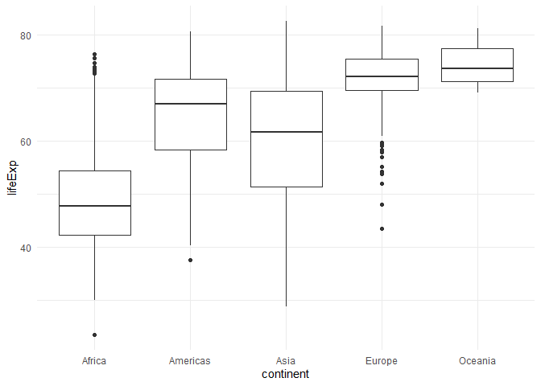

# summarystatistics descrtiption

The R package `summarystatistics` includes the function
`summarize_stats`. The function computes five summary statistics
(minimum, maximum, mean, and two quantiles) of a numerical variable
across the groups of a categorical variable. The function also produces
simple boxplots that allow for the visual comparison of distributions
between the groups of the categorical variable.

## Installation instructions

To install `summarystatistics` package from GitHub use:

``` r
devtools::install_github("kearutherford/Assignment_B2_Rutherford")
```

## Demonstrations

``` r
# Load required packages -----------------------------------------------------------------------------
suppressPackageStartupMessages(library(datateachr))
suppressPackageStartupMessages(library(gapminder))
suppressPackageStartupMessages(library(palmerpenguins))
suppressPackageStartupMessages(library(summarystatistics))
```

The following examples demonstrate how to use the `summarize_stats`
function in the R package `summarystatistics`. The examples rely on the
[vancouver_trees](https://opendata.vancouver.ca/explore/dataset/street-trees/information/?disjunctive.species_name&disjunctive.common_name&disjunctive.height_range_id&location=11,49.26339,-123.12046)
data set included in the `datateachr` package, the
[gapminder](https://www.rdocumentation.org/packages/gapminder/versions/0.3.0)
data set included in the `gapminder` package, and the
[penguins](https://allisonhorst.github.io/palmerpenguins/) data set
included in the `palmerpenguins` package.

### Example #1: Character variable input, keep default arguments

**Description of inputs:**  
This example demonstrates inputting a variable with a character class
for the `categoric_var` argument. The default arguments are kept
(`prob1` = 0.25, `prob2` = 0.75, `na.rm` = TRUE).

| Argument      | Input           | Description of Input                                      | Class     |
|:--------------|:----------------|:----------------------------------------------------------|:----------|
| data          | vancouver_trees | provides an inventory of public street trees in Vancouver | tbl_df    |
| categoric_var | root_barrier    | root_barrier installed (Y = Yes, N = No)                  | character |
| numeric_var   | diameter        | diameter at breast height (DBH) of trees in inches        | numeric   |

``` r
# Run summarize_stats() function with vancouver_trees data set ---------------------------------------
summarize_stats(data = datateachr::vancouver_trees, 
                categoric_var = root_barrier,
                numeric_var = diameter)
#> [[1]]
#> # A tibble: 2 x 6
#>   root_barrier minimum maximum  mean quantile_1 quantile_2
#>   <chr>          <dbl>   <dbl> <dbl>      <dbl>      <dbl>
#> 1 N                0       435 12.0           4         17
#> 2 Y                0.5      86  4.40          3          5
#> 
#> [[2]]
```


**Description of output:** The output is a list with two items: a tibble
of summary statistics and a simple set of boxplots. For the summary
tibble, the minimum, maximum, mean, first quartile, and third quartile
were calculated for DBH across the two root barrier groups (Y/N). The
boxplots show the difference in the distributions of DBH between the two
root barrier groups.

### Example #2: Factor variable input, alter default arguments

**Description of inputs:**  
This example demonstrates inputting a variable with a factor class for
the `categoric_var` argument. The `prob1` and `prob2` arguments are set
to `prob1` = 0.1 and `prob2` = 0.9. The default argument `na.rm = TRUE`
is kept.

| Argument      | Input     | Description of Input                                      | Class   |
|:--------------|:----------|:----------------------------------------------------------|:--------|
| data          | gapminder | contains global socioeconomic information                 | tbl_df  |
| categoric_var | continent | five continents (Africa, Americas, Asia, Europe, Oceania) | factor  |
| numeric_var   | lifeExp   | life expectancy at birth                                  | numeric |

``` r
# Run summarize_stats() function with gapminder data set ---------------------------------------------
summarize_stats(data = gapminder::gapminder, 
                categoric_var = continent,
                numeric_var = lifeExp,
                prob1 = 0.1,
                prob2 = 0.9)
#> [[1]]
#> # A tibble: 5 x 6
#>   continent minimum maximum  mean quantile_1 quantile_2
#>   <fct>       <dbl>   <dbl> <dbl>      <dbl>      <dbl>
#> 1 Africa       23.6    76.4  48.9       38.4       60.8
#> 2 Americas     37.6    80.7  64.7       50.6       74.9
#> 3 Asia         28.8    82.6  60.1       42.9       74.2
#> 4 Europe       43.6    81.8  71.9       65.9       78.3
#> 5 Oceania      69.1    81.2  74.3       70.3       79.9
#> 
#> [[2]]
```



**Description of output:** The output is a list with two items: a tibble
of summary statistics and a simple boxplot. For the summary tibble, the
minimum, maximum, mean, 10th percentile, and 90th percentile were
calculated for life expectancy across the five continents (Africa,
Americas, Asia, Europe, and Oceania). The boxplots show the distribution
of life expectancy for each continent.

### Example #3: Factor variable input, alter default arguments

**Description of inputs:**  
This example also demonstrates inputting a variable with a factor class
for the `categoric_var` argument. The `prob1` and `prob2` arguments are
set to `prob1` = 0.2 and `prob2` = 0.8. The default argument
`na.rm = TRUE` is kept.

| Argument      | Input             | Description of Input                                  | Class   |
|:--------------|:------------------|:------------------------------------------------------|:--------|
| data          | penguins          | contains size measurements for penguins in Antarctica | tbl_df  |
| categoric_var | species           | three penguin species (Adelie, Chinstrap, Gentoo)     | factor  |
| numeric_var   | flipper_length_mm | flipper length in millimeters                         | numeric |

``` r
# Run summarize_stats() function with penguins data set ----------------------------------------------
summarize_stats(data = palmerpenguins::penguins, 
                categoric_var = species,
                numeric_var = flipper_length_mm,
                prob1 = 0.2,
                prob2 = 0.8)
#> [[1]]
#> # A tibble: 3 x 6
#>   species   minimum maximum  mean quantile_1 quantile_2
#>   <fct>       <int>   <int> <dbl>      <dbl>      <dbl>
#> 1 Adelie        172     210  190.        185        195
#> 2 Chinstrap     178     212  196.        190        201
#> 3 Gentoo        203     231  217.        211        222
#> 
#> [[2]]
```


**Description of output:** The output is a list with two items: a tibble
of summary statistics and a simple boxplot. For the summary tibble, the
minimum, maximum, mean, 20th percentile, and 80th percentile were
calculated for flipper length across the three species (Adelie,
Chinstrap, and Gentoo). The boxplots show the distribution of flipper
length for each species.

### Example #4: Error from invalid argument

**Description of inputs:**  
This example demonstrates inputting a factor variable for the
`numeric_var` argument.

| Argument      | Input    | Description of Input                                  | Class  |
|:--------------|:---------|:------------------------------------------------------|:-------|
| data          | penguins | contains size measurements for penguins in Antarctica | tbl_df |
| categoric_var | species  | three penguin species (Adelie, Chinstrap, Gentoo)     |        |
| numeric_var   | island   | three islands (Biscoe, Dream, Torgersen)              | factor |

``` r
# Run summarize_stats() function with penguins data set ----------------------------------------------
summarize_stats(data = palmerpenguins::penguins, 
                categoric_var = species,
                numeric_var = island)
#> Error in summarize_stats(data = palmerpenguins::penguins, categoric_var = species, : The parameter numeric_var requires a numerical variable.
#> You have input a variable of class: factor
```

**Description of output:** The function throws an error message. The
message informs the user that the parameter `numeric_var` requires the
input of a numerical variable. In this case the input for the argument
was a variable of class factor. Custom error messages also appear for
invalid arguments of the other two parameters (`data` and
`categoric_var`).
